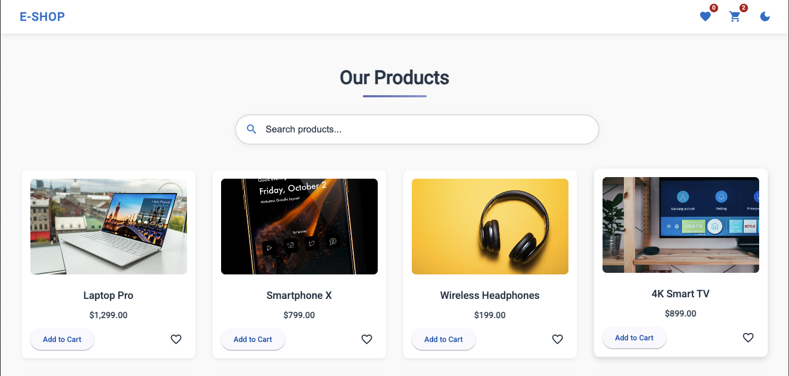

# E-Shop - Modern E-commerce Application

[](https://angular.io/)
[](https://ngrx.io/)
[](https://material.angular.io/)

A modern, responsive e-commerce application built with Angular, NgRx for state management, and Angular Material for UI components. This application showcases best practices in Angular development including lazy loading, reactive state management, and modular architecture.

## Live Demo
https://e-shop-angular.netlify.app/



## Features

- **Product Catalog**

  - Browse products by categories
  - Product details with images and descriptions
  - Product search functionality

- **Shopping Cart**

  - Add/remove products
  - Update quantities
  - View cart summary
  - Proceed to checkout

- **Wishlist**

  - Save favorite products
  - Move items to cart

- **Theming**

  - Light/Dark mode toggle
  - Responsive design for all devices

- **Performance**
  - Lazy-loaded feature modules
  - Optimized bundle size
  - Efficient change detection

## Technologies Used

- **Frontend Framework**: Angular 20+
- **State Management**: NgRx (Store, Effects, Entity)
- **UI Components**: Angular Material
- **Styling**: SCSS with CSS Variables for theming
- **Build Tool**: Angular CLI
- **Package Manager**: npm

## Getting Started

### Prerequisites

- Node.js (v18 or later)
- npm (v9 or later) or yarn
- Angular CLI (v20 or later)

### Installation

1. **Clone the repository**

   ```bash
   git clone https://github.com/EmekaNkwo/E-Shop.git
   cd E-Shop
   ```

2. **Install dependencies**

   ```bash
   npm install
   # or
   yarn install
   ```

3. **Start the development server**
   ```bash
   ng serve
   ```
   The application will be available at `http://localhost:4200/`

## Project Structure

```
src/
├── app/
│   ├── core/               # Core module (singleton services, auth, interceptors)
│   ├── features/           # Feature modules (products, cart, etc.)
│   │   ├── cart/           # Shopping cart functionality
│   │   ├── products/       # Product listing and details
│   │   └── wishlist/       # Wishlist functionality
│   ├── shared/             # Shared components, directives, pipes
│   └── app.component.*     # Root component
├── assets/                 # Static assets
├── environments/           # Environment configurations
└── styles/                 # Global styles and theming
```

## Running Tests

Run unit tests:

```bash
ng test
```

Run end-to-end tests:

```bash
ng e2e
```

## Build

Build the project:

```bash
ng build
```

The build artifacts will be stored in the `dist/` directory.

## Contributing

Contributions are welcome! Please follow these steps:

1. Fork the repository
2. Create your feature branch (`git checkout -b feature/AmazingFeature`)
3. Commit your changes (`git commit -m 'Add some AmazingFeature'`)
4. Push to the branch (`git push origin feature/AmazingFeature`)
5. Open a Pull Request

## License

This project is licensed under the MIT License - see the [LICENSE](LICENSE) file for details.

## Acknowledgments

- [Angular](https://angular.io/) - The web framework used
- [NgRx](https://ngrx.io/) - State management
- [Angular Material](https://material.angular.io/) - UI components
- [Unsplash](https://unsplash.com/) - For the beautiful product images

---
